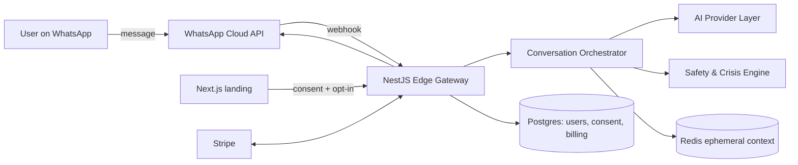
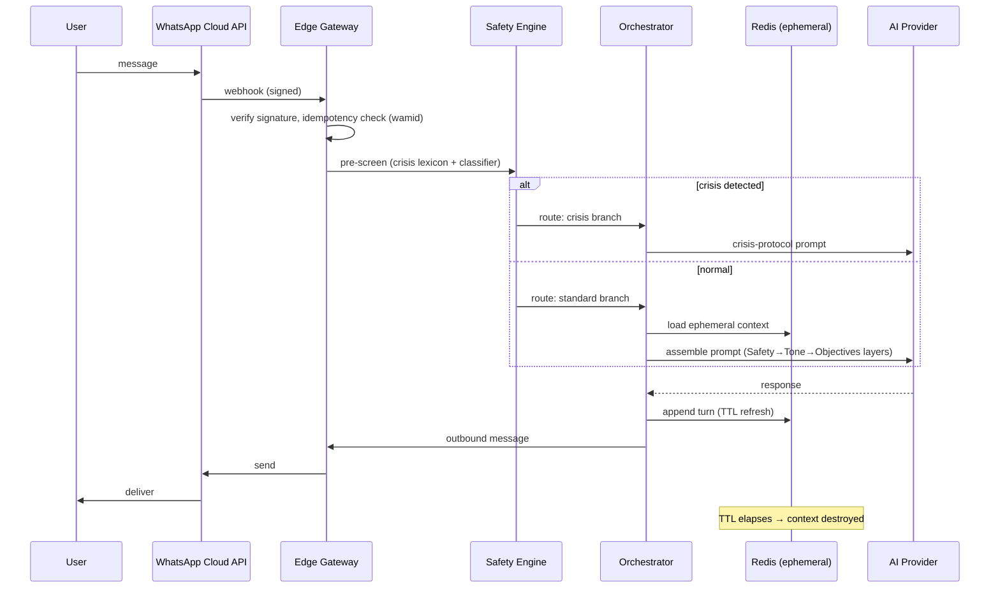

# Between Clouds — Master Architecture Blueprint

**Version:** 2.0 — Foundational Engineering Specification
**Status:** Canonical. All implementations must comply with this document.
**Last updated:** 2026-05-09

---

## 1. Purpose of this document

This is the **single source of truth for the engineering shape of Between
Clouds**. It translates the product philosophy ("Ephemeral Emotional Computing")
into:

- a system architecture,
- explicit non-functional requirements (NFRs),
- the boundaries of every subsystem,
- the contracts between subsystems,
- the operational and ethical constraints code must enforce.

Detail per domain lives in `docs/`. This document is the integrating view.

---

## 2. Product in one diagram



Two surfaces, one nervous system:

- **WhatsApp** — the conversational surface. This is where the product *is*.
- **Web (Next.js)** — onboarding, consent, billing, marketing, account
  management. The web does **not** host conversation UI.

---

## 3. System decomposition

| Component              | Responsibility                                              | Tech                       |
| ---------------------- | ----------------------------------------------------------- | -------------------------- |
| Web (Landing/Account)  | Marketing, consent capture, plan selection, account control | Next.js, Tailwind, Framer  |
| Edge Gateway           | Webhook ingress, auth, rate limit, signature verification   | NestJS on Vercel/Node edge |
| Conversation Orchestrator | Session lifecycle, prompt assembly, provider routing     | NestJS service             |
| Safety & Crisis Engine | Detection, de-escalation, resource handoff                  | NestJS module + rules + LLM|
| AI Provider Layer      | Provider abstraction (OpenAI flagship, BYO keys, future)    | NestJS adapter pattern     |
| Ephemeral Context Store| Per-session conversational state, TTL-bound                 | Redis                      |
| Durable Metadata Store | Users, subscriptions, consent logs, opt-in memory profiles  | PostgreSQL                 |
| Job Runner             | Scheduled cleanup, billing reconciliation, async tasks      | BullMQ on Redis            |
| Realtime Bus           | Internal pub/sub for orchestration events                   | WebSocket Gateway / Redis  |
| Billing                | Subscriptions, currency-aware checkout                      | Stripe                     |
| Observability          | Health metrics — *not* engagement metrics                   | OpenTelemetry + sink TBD   |

The stack and table above are normative for v1. Substitutions require an ADR.

---

## 4. Non-functional requirements (NFRs)

These are the engineering invariants. They are **as binding as the data model**.

### 4.1 Privacy & ephemerality

- **NFR-P1.** Conversation content MUST NOT be persisted to durable storage in
  Cloud Session mode. Only Redis with bounded TTL.
- **NFR-P2.** Default session TTL ≤ 30 minutes of inactivity. Hard cap 4h
  total per session.
- **NFR-P3.** Session termination MUST trigger explicit Redis `DEL` of all
  keys belonging to that session (no reliance on TTL alone for end-of-session).
- **NFR-P4.** No conversation content may appear in logs, traces, error
  reports, analytics, or LLM training pipelines. Redaction is mandatory at
  source, not at sink.
- **NFR-P5.** Memory Mode is OFF by default. Enabling it is an explicit,
  reversible, logged user action with a dedicated consent record.

### 4.2 Security

- **NFR-S1.** TLS 1.2+ for all external traffic. mTLS or signed JWT for
  inter-service traffic.
- **NFR-S2.** WhatsApp webhook signatures verified on every request; replay
  window ≤ 5 min.
- **NFR-S3.** All secrets in a managed secret store (no `.env` in git).
- **NFR-S4.** PII (phone number, country) encrypted at rest with envelope
  encryption; phone number indexed via deterministic HMAC, not plaintext.
- **NFR-S5.** Rate limits: per-phone, per-IP, per-tenant. Documented in
  `docs/04-backend.md`.

### 4.3 Reliability

- **NFR-R1.** Webhook ingress availability target 99.9% monthly.
- **NFR-R2.** Webhook processing must be idempotent on `wamid` (WhatsApp
  message id).
- **NFR-R3.** AI provider outages must degrade gracefully into a calm,
  non-clinical "I cannot reach the right space right now — try again in a
  moment" message. Never expose stack traces or model errors to users.

### 4.4 Calm-by-design (product NFRs)

- **NFR-C1.** No streaks, badges, gamification, or push-notification nudges
  back into the product.
- **NFR-C2.** Analytics MUST NOT track DAU/MAU/retention as primary metrics.
  See `docs/11-observability.md`.
- **NFR-C3.** First system response in any session MUST NOT be
  "How can I help you?" or any equivalent task-framed phrasing.

### 4.5 Compliance

- **NFR-L1.** GDPR + LGPD compliance. Data subject access/erasure within 30 days.
- **NFR-L2.** Every user-visible surface that may be confused with therapy
  must carry a "not therapy / not medical advice / not emergency support"
  notice in the user's locale.

---

## 5. Data flow — message lifecycle



Key invariants:

1. **Safety pre-screen runs before context retrieval.** A crisis user in their
   first message must hit the crisis path even with empty context.
2. **Idempotency on `wamid`.** WhatsApp will retry; duplicate processing must
   be impossible.
3. **TTL refresh on every turn.** Inactivity → Redis evicts → session ends.

---

## 6. Subsystem contracts (overview)

Detail in domain docs; this is the integrating index.

### 6.1 Web → Backend

- `POST /api/onboarding/consent` — records consent record, returns WhatsApp
  deeplink. Idempotent on `consent_token`.
- `POST /api/billing/checkout` — currency-aware Stripe Checkout session.
- `POST /api/account/memory-mode` — opt-in / opt-out toggle (Pro only).
- `POST /api/account/erase` — GDPR/LGPD erasure request.

### 6.2 WhatsApp → Backend

- `POST /webhooks/whatsapp` — Meta Cloud API webhook. Signature-verified,
  idempotent, returns 200 within 5s budget; heavy work is queued.

### 6.3 Backend → AI Provider Layer

Adapter interface (TypeScript pseudo):

```ts
interface AIProvider {
  id: 'openai-flagship' | 'openai-byo' | string;
  generate(input: PromptBundle, ctx: ProviderCtx): Promise<AIResponse>;
  streamGenerate?(input: PromptBundle, ctx: ProviderCtx): AsyncIterable<AIChunk>;
}
```

`PromptBundle` is the layered prompt (Safety / Tone / Objectives / Locale /
EphemeralContext). The provider layer **never** sees PII beyond the
ephemeral context window the orchestrator has already redacted.

### 6.4 Backend ↔ Stripe

- Webhooks: `customer.subscription.*`, `invoice.*`. Signature-verified.
- All currency selection happens server-side from `localization_settings`.

### 6.5 Internal events

Emitted on Redis pub/sub for the realtime gateway and analytics sink:

- `session.opened`, `session.closed`, `session.expired`
- `crisis.detected` (no message content; only severity + locale)
- `billing.upgraded`, `billing.cancelled`
- `consent.recorded`, `consent.revoked`

---

## 7. Architectural decisions (summary)

| ADR | Decision                                            | Rationale                          |
| --- | --------------------------------------------------- | ---------------------------------- |
| 0001| Ephemeral-by-default conversational state           | Core product premise               |
| 0002| WhatsApp-first; web is not a chat UI                | Ambient presence, distribution     |
| 0003| NestJS + PostgreSQL + Redis + BullMQ                | Maturity, modular boundaries       |
| 0004| Bring-your-own OpenAI key as cost lever             | Margin and user agency             |
| 0005| No engagement-style analytics                       | Anti-addiction posture is binding  |

Full text in `docs/adr/`.

---

## 8. Environments

| Env       | Purpose                          | Data                       |
| --------- | -------------------------------- | -------------------------- |
| `local`   | Developer machine                | Synthetic only             |
| `preview` | Per-PR ephemeral environment     | Synthetic only             |
| `staging` | Pre-prod, full integrations      | Synthetic + opted-in QA    |
| `prod`    | Production                       | Real, under privacy regime |

Real user data (even hashed phone numbers) MUST NOT leave `prod`. No prod
dump → staging pipeline. Synthetic data only.

---

## 9. Build, test, deploy

- **Web:** Next.js on Vercel; preview deployments per PR.
- **Backend:** Node 20+, NestJS, container image; deployment target managed
  Kubernetes or Fly.io (decision deferred — see roadmap).
- **CI:** lint, typecheck, unit, contract tests for webhook signatures and
  Stripe events, prompt-injection regression tests for the Safety Engine.
- **Release:** trunk-based; backend behind feature flags; web behind
  per-route flags. No "big bang" releases for Safety changes — they ship
  behind a shadow-evaluation window first.

Detail in `docs/13-roadmap.md`.

---

## 10. What this document is *not*

- It is not a backlog. Implementation sequencing lives in `docs/13-roadmap.md`.
- It is not a marketing brief. Tone and product positioning live in
  `docs/01-product-philosophy.md`.
- It is not flexible on NFRs. Section 4 is binding.

Any deviation from this document requires a new ADR in `docs/adr/`, merged
before the deviating code.
