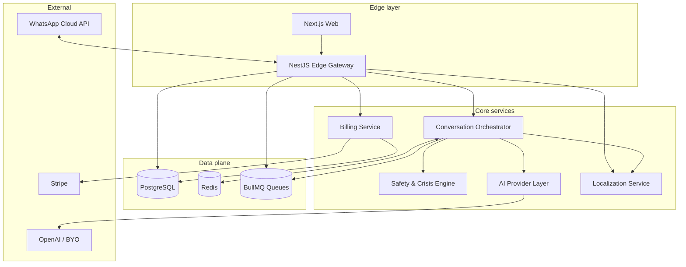
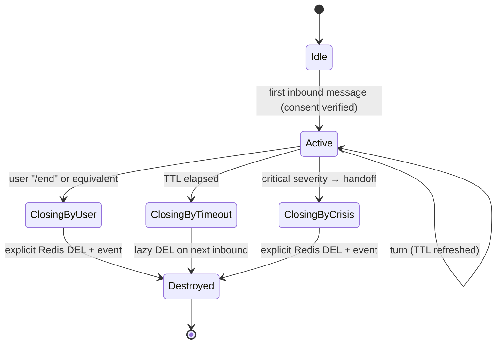

# 02 — System architecture

Detail view of the components introduced in `ARCHITECTURE.md §3`.

## 1. Topology

## 2. Component responsibilities

### 2.1 Web (Next.js)

- Public landing, editorial content, pricing, legal.
- Onboarding: consent → presence selection → optional name → WhatsApp deeplink.
- Authenticated account zone: subscription, Memory Mode toggle, erase request.
- **Not** a chat surface. No realtime conversation UI on the web.

### 2.2 Edge Gateway (NestJS)

- HTTPS/Webhook ingress.
- Signature verification (WhatsApp, Stripe).
- Idempotency layer (Redis-backed, keyed on `wamid` and Stripe `event.id`).
- Rate limiting (per phone, per IP, per Stripe customer).
- Auth for the web account zone (session cookies, OAuth optional).
- Translates external events into internal commands and dispatches them.

### 2.3 Conversation Orchestrator

- Owns the **session lifecycle** state machine (see §4).
- Loads/refreshes ephemeral context from Redis.
- Assembles the layered prompt.
- Picks the AI provider (flagship vs BYO key).
- Persists turns into ephemeral context only.
- Emits `session.*` events.

### 2.4 Safety & Crisis Engine

- Pre-screen on every inbound message: lexicon + classifier + locale-aware
  rules.
- Outputs a `SafetyVerdict` { severity, category, locale, action }.
- For severity ≥ `high`, the orchestrator switches to the crisis prompt
  branch and surfaces local resources.
- Post-screen on outbound model output: blocks possessive/romantic drift,
  clinical claims, encouragement of dependency.

### 2.5 AI Provider Layer

- Adapter interface (see ARCHITECTURE.md §6.3).
- Adapters: `openai-flagship`, `openai-byo`, future `multimodal-realtime`.
- Per-tenant routing rules from `subscriptions.plan` and
  `account.byo_key_present`.
- Token accounting and cost telemetry (no message content).

### 2.6 Billing Service

- Stripe Checkout creation (currency-aware).
- Webhook reconciliation.
- Plan → entitlement mapping (session length, voice, memory eligibility).

### 2.7 Localization Service

- Locale resolution from { explicit user preference, IP, browser, WA profile }.
- Currency resolution (independent from language; e.g. EN UI + BRL pricing OK).
- String catalog access for backend-emitted text (system-injected messages,
  notifications, error fallbacks).

## 3. Process & deployment view

| Service              | Process model                | Scaling axis            |
| -------------------- | ---------------------------- | ----------------------- |
| Web                  | Vercel Serverless / Edge     | Per-request             |
| Edge Gateway         | Long-lived Node + workers    | CPU-bound on signature  |
| Orchestrator         | Long-lived Node              | I/O-bound, AI calls     |
| Safety Engine        | In-process module + workers  | LLM-bound for classifier|
| Workers (BullMQ)     | Separate worker pool         | Queue depth             |
| Postgres             | Managed (e.g. Neon/RDS)      | Vertical + read replica |
| Redis                | Managed (e.g. Upstash/Elasticache) | Memory + ops/sec  |

The orchestrator and Safety Engine MAY share a process in v1 to minimize
latency (one fewer network hop on the hot path). They MUST remain logically
separated modules so they can be split later without API change.

## 4. Session state machine

Invariants:

- Every transition emits an event.
- `Destroyed` is terminal — there is no resurrection. A new message starts a
  fresh session.
- Memory Mode users get a separate, **parallel** durable profile, never a
  resurrected ephemeral session.

## 5. Failure modes & degradation

| Failure                             | User-visible behavior                              |
| ----------------------------------- | -------------------------------------------------- |
| AI provider 5xx / timeout           | Calm fallback message + retry budget; no traceback |
| Redis unavailable                   | Refuse new sessions with calm message; preserve consent|
| Postgres unavailable                | Block billing/account ops; allow active sessions to finish|
| WhatsApp webhook signing key rotated| Reject + alert; do not auto-trust                  |
| Stripe webhook replay               | Idempotent handler dedupes on `event.id`           |
| Safety classifier outage            | Conservative deny: route to "I can't be the right space right now" + local resources |

The last row is critical: the Safety Engine is a **fail-closed** dependency
on the conversational hot path. Latency budgets in §6 reflect this.

## 6. Latency budgets (per inbound message)

| Step                          | Target  | Hard ceiling |
| ----------------------------- | ------- | ------------ |
| Webhook ingress + signature   | 50 ms   | 200 ms       |
| Idempotency check             | 10 ms   | 50 ms        |
| Safety pre-screen             | 200 ms  | 800 ms       |
| Context load (Redis)          | 20 ms   | 100 ms       |
| AI generation                 | 2.0 s   | 6.0 s        |
| Safety post-screen            | 150 ms  | 600 ms       |
| Outbound to WhatsApp          | 200 ms  | 800 ms       |
| **End-to-end (median)**       | **~2.7 s** | **~8.5 s** |

If the AI provider is approaching the ceiling, the orchestrator emits an
"I'm here, taking a moment" calm interstitial — never a typing indicator
loop and never an apology.

## 7. Boundaries that must hold

These are architectural rules that any refactor must preserve:

1. **The web never holds conversation content.** Not even in transit.
2. **The orchestrator is the only writer to Redis ephemeral context.**
3. **The Safety Engine is the only producer of `SafetyVerdict`.** The
   orchestrator is the only consumer.
4. **The AI Provider Layer never receives raw PII.** The orchestrator
   redacts before calling.
5. **Postgres never stores conversation turns.** Schema-level constraint
   enforced by review and a CI test.
