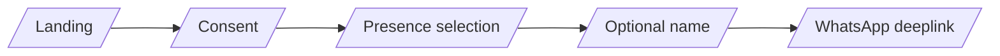

# 03 — Frontend (Next.js)

## 1. Scope

The web exists for **entry, consent, billing, account, and editorial content**.
It is not a conversation surface. There is no chat UI, no realtime presence,
no message inbox.

## 2. Stack

| Layer            | Choice                            |
| ---------------- | --------------------------------- |
| Framework        | Next.js (App Router)              |
| Language         | TypeScript (strict)               |
| Styling          | TailwindCSS (Twind acceptable)    |
| Motion           | Framer Motion                     |
| Hosting          | Vercel (Edge for static, Node for auth/billing routes) |
| i18n             | `next-intl`                       |
| Forms / validation | Zod + React Hook Form           |
| Auth (account zone) | Cookie session via backend     |
| Analytics        | Privacy-first sink only — see `11-observability.md` |

## 3. Routes

```
/                       Landing
/about                  Editorial
/why-ephemeral          Editorial
/pricing                Plans + currency-aware pricing
/legal/privacy          Privacy policy (per-locale)
/legal/terms            Terms (per-locale)
/legal/disclaimers      "Not therapy" notice (per-locale)
/onboarding             Consent → presence → name → WA deeplink
/account                Plan, Memory Mode, language, erase
/account/billing        Stripe portal redirect
/api/*                  Server actions / route handlers (see §6)
```

All routes are localizable via `[locale]` segment. Default `en`. Required
parity: `pt-BR`.

## 4. Design system

### 4.1 Visual philosophy

Breathable, atmospheric, quiet, deep, soft. Large white (or rather, deep)
space. No dashboards. No metrics. No densified UIs.

### 4.2 Color tokens

```ts
// tailwind.config.ts (excerpt)
colors: {
  bg: {
    night:  '#0A0E1A',
    deep:   '#10172A',
    fog:    '#1B2236',
  },
  cloud: {
    soft:   '#A9C7E8',
    blue:   '#7AA8D6',
    glow:   '#C8DDF2',
  },
  ink: {
    primary:   '#E7ECF3',
    secondary: '#A6B0C0',
    muted:     '#5C6577',
  },
}
```

Contrast ratios: text-on-background must clear WCAG AA (4.5:1 for body,
3:1 for large). Low-vision dark mode is the default — there is no light mode
in v1.

### 4.3 Typography

Primary: Inter. Acceptable alternates: Geist, SF Pro. Body 16–18px, line
height 1.6+. Headings tracked tighter (-0.01em). No display fonts. No
all-caps except micro-labels.

### 4.4 Motion

Slow, breathing, atmospheric. Reference durations:

```ts
export const motion = {
  enter: { duration: 0.9, ease: [0.22, 0.61, 0.36, 1] },
  exit:  { duration: 0.6, ease: [0.4, 0, 0.6, 1] },
  breath: { duration: 6.0, ease: 'easeInOut', repeat: Infinity, repeatType: 'mirror' },
};
```

Disallowed: bouncy springs > 0.6 amplitude, parallax that races the cursor,
hover states that pulse faster than 1 Hz.

`prefers-reduced-motion: reduce` MUST disable all decorative motion.

### 4.5 The atmospheric presence component

A reusable `<CloudPresence />` component:

- WebGL or layered SVG/CSS — implementation choice deferred.
- Respects `prefers-reduced-motion`.
- Accepts `mood: 'idle' | 'listening' | 'speaking'` for future surfaces.
- On the landing it floats; on `/onboarding` it gently centers; on
  `/account` it is small and quiet.

## 5. Onboarding flow (web)



Rules:

- Each step is one screen. No multi-column forms.
- The consent screen lists what is stored, where, for how long, and what is
  not stored. In the user's locale.
- Presence selection has three options: official, upload, initials. Default
  is official. "Recommended" affordances are disallowed.
- Optional name is genuinely optional — skip is the most prominent action
  after "Continue".
- The WhatsApp deeplink uses `wa.me/<biz>?text=<consent_token>` with a
  one-time token. The token authenticates the first WhatsApp message.

## 6. Backend contracts the frontend calls

| Method | Path                                | Purpose                          |
| ------ | ----------------------------------- | -------------------------------- |
| POST   | `/api/onboarding/consent`           | Record consent, return WA deeplink + token |
| POST   | `/api/billing/checkout`             | Currency-aware Stripe Checkout   |
| POST   | `/api/billing/portal`               | Stripe customer portal session   |
| POST   | `/api/account/memory-mode`          | Toggle Memory Mode (Pro)         |
| POST   | `/api/account/locale`               | Update language / currency       |
| POST   | `/api/account/erase`                | GDPR/LGPD erasure                |
| GET    | `/api/account/me`                   | Account snapshot                 |

All POSTs require CSRF protection and are idempotent on a client-supplied
`Idempotency-Key`.

## 7. Editorial content

Sections: emotional overload, burnout, loneliness, routines, uncertainty,
silence, digital fatigue, identity. Tone: literary, contemplative,
emotionally intelligent, scientifically grounded. Authoring is content,
not engineering — but the CMS choice (MDX in repo vs headless CMS) is an
engineering decision deferred until v1.1; default is **MDX in repo** for
review hygiene and locale parity.

## 8. Accessibility

- WCAG 2.2 AA target.
- All interactive elements keyboard-reachable; focus rings visible against
  deep backgrounds (use `cloud.glow` outline).
- Reduced motion respected.
- Screen-reader: the atmospheric presence is `aria-hidden`. It is decorative.

## 9. Performance budgets

| Metric                     | Budget              |
| -------------------------- | ------------------- |
| LCP (landing, 4G)          | < 2.5 s             |
| CLS                        | < 0.05              |
| Initial JS (landing)       | < 90 KB gz          |
| Edge cache hit rate        | > 90% on `/`        |

The atmospheric presence MUST NOT block LCP. It mounts post-hydration.
