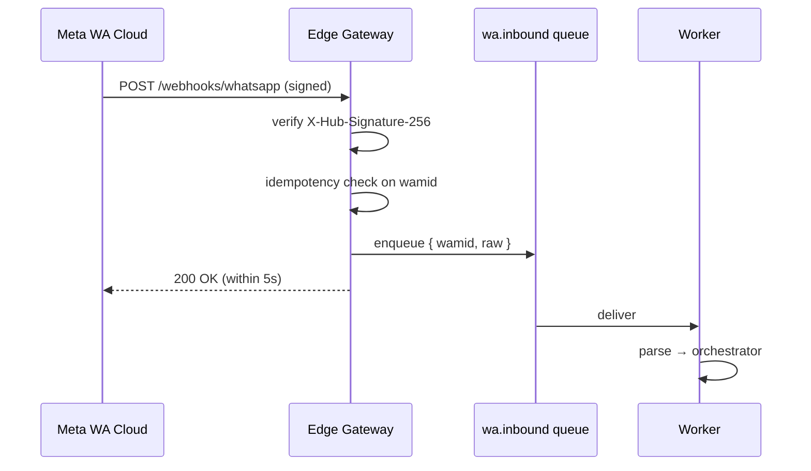

# 05 — WhatsApp integration

## 1. Providers

| Role     | Provider                            | Use                          |
| -------- | ----------------------------------- | ---------------------------- |
| Primary  | Meta WhatsApp Business Cloud API    | Day one                      |
| Fallback | Twilio WhatsApp                     | Region/outage failover       |
| Fallback | 360Dialog                           | EU-resident routing option   |

The provider is abstracted behind a `WhatsAppProvider` adapter so the
orchestrator never depends on a specific vendor.

```ts
interface WhatsAppProvider {
  id: 'meta' | 'twilio' | '360dialog';
  verifySignature(req: RawRequest): boolean;
  parseInbound(req: RawRequest): InboundMessage[];
  send(out: OutboundMessage): Promise<SendReceipt>;
}
```

## 2. Numbers, business profile, identity

- One verified WhatsApp Business number per region (UK, EU, BR, US) where
  feasible. Region routing is by user locale resolution, not phone country.
- Business profile name: **"Between Clouds"**. Avatar: official atmospheric
  presence asset.
- About text: a short calm phrase in the user's locale (EN/PT-BR parity).
- No automated greeting templates that read like a chatbot intro.

## 3. Inbound webhook handling



Hard rules:

- The webhook handler MUST return 200 within 5 s. No synchronous AI calls
  in the handler.
- Duplicate `wamid` → 200 + skip.
- Unverifiable signature → 401 + alert.

## 4. Outbound delivery

- `wa.outbound` worker sends messages via the active provider.
- Backoff: 1 s, 4 s, 16 s, 60 s, 5 min. After 5 attempts, drop and emit a
  `delivery.failed` event with no message content.
- "Typing" indicator usage: SPARING. Calm interactions use silence, not
  typing animations. The typing indicator is allowed only when the AI
  generation is mid-flight and is expected to land within 3 s.

## 5. Templates

Meta requires approved templates for messages outside the 24-hour customer
service window. We use templates only for:

- consent confirmation,
- billing notices (failed payment, renewal reminder once),
- erasure completion confirmation.

We do NOT use templates for:

- re-engagement,
- "we miss you",
- "your last conversation…",
- promotional content of any kind.

## 6. Consent token & first message

- The web onboarding emits a single-use `consent_token` and deeplinks the
  user to WhatsApp with that token in the message body.
- The first inbound message is parsed for the token. If valid, the
  orchestrator binds `wa_id` ↔ `user.id` and clears the token.
- If invalid or missing on the very first contact (e.g. user messaged the
  number directly), the orchestrator routes to a calm
  "let's set this up" path that links back to the web for consent.

## 7. Session boundaries on WhatsApp

- A session opens on the first inbound message after `Idle`.
- A session ends on TTL, on `/end` (and locale equivalents), or on crisis
  handoff.
- Session end is announced to the user with a single calm line in their
  locale, e.g. (EN) "Closing this space. Take what was useful — leave the
  rest." (PT-BR) "Encerrando este espaço. Leve o que foi útil — deixe o
  resto."

## 8. Privacy on the WhatsApp surface

- We do not store inbound message content beyond the live ephemeral
  context window (Redis, TTL-bound).
- `wa_id` (the user's WhatsApp identifier) is HMAC-hashed before being used
  as a join key in Postgres. The plaintext `wa_id` is never stored.
- Media (voice, images) handling is **deferred to v1.1**. v1 is text-only
  to keep the privacy surface tight.

## 9. Failure handling

| Failure                          | Behavior                                          |
| -------------------------------- | ------------------------------------------------- |
| Meta Cloud API outage            | Auto-failover to Twilio; same business identity   |
| Webhook delivery failed at Meta  | Meta retries with backoff; we dedupe              |
| Outbound 429                     | Queue backoff; never user-visible apology         |
| Number suspended                 | Page on-call; route inbound to "back soon" calm note via fallback number |

## 10. Compliance notes

- WhatsApp Business policy disallows certain content categories. The
  Safety Engine is the enforcement point — it must reject prohibited
  categories before they reach the send path.
- We honor user blocks immediately: any inbound `messages.statuses` event
  with the user blocking us triggers an account flag and stops outbound.
