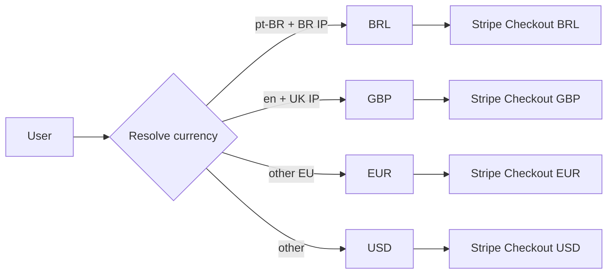

# 10 — Internationalization & payments

## 1. Locale model

Two independent axes:

- **Language** (`locale`, BCP-47): drives all user-visible text.
- **Currency** (ISO-4217): drives pricing and Stripe checkout.

These are independent. A Brazilian user travelling in the UK may keep
`pt-BR` UI with `BRL` currency, or switch either independently.

## 2. Required language coverage

| Tier        | Languages                        | Status            |
| ----------- | -------------------------------- | ----------------- |
| v1 launch   | `en`, `pt-BR`                    | 100% parity required |
| v1.1        | `es`, `fr`                       | planned           |
| Future      | `de`, `it`, `ja`, …              | demand-driven     |

"100% parity" means every user-visible string, every WhatsApp template,
every email, every legal page is reviewed by a native speaker at merge.

## 3. Resolution order

1. Explicit user preference (`localization_settings.locale`).
2. WhatsApp profile language hint (when available).
3. Browser `Accept-Language` (web flows).
4. IP-based country → default language for that country.
5. Fallback: `en`.

Currency follows the same order, with the AI provider region constraint
acting as a tiebreaker if needed.

## 4. Implementation

- Web: `next-intl`. Catalogs at `/i18n/{locale}.json`. Route segment
  `/[locale]/...`.
- Backend: a `LocalizationService` reads the same catalogs (shared package)
  for emitted system messages. WhatsApp outbound uses the user's stored
  locale, not request-derived.
- AI prompts: Layer 4 (Locale) injects locale-specific tone and crisis
  resource lists.

## 5. Catalog discipline

- Keys are namespaced: `landing.hero.title`, `onboarding.consent.body`,
  `wa.session.greeting`, `wa.session.closing`, `crisis.resources.intro`.
- No string concatenation across keys. ICU MessageFormat for plurals,
  gender, number formatting.
- A CI check fails if any locale is missing a key present in the source
  locale.

## 6. Pricing

| Plan  | GBP    | USD    | EUR    | BRL     |
| ----- | ------ | ------ | ------ | ------- |
| Free  | £0     | $0     | €0     | R$0     |
| Plus  | £12–19 | $14–22 | €13–21 | R$59–99 |
| Pro   | £39–59 | $44–66 | €43–65 | R$199–299 |

Final pricing is set per-launch by the business; the table is the design
range. Stripe price IDs are stored in config keyed by `(plan, currency)`.

## 7. Smart checkout



- The currency at first checkout is sticky: future renewals stay in that
  currency.
- Currency change requires cancelling and re-subscribing; we surface this
  honestly.

## 8. Tax

- VAT/Sales tax handled by Stripe Tax where available.
- For BR (ICMS/ISS implications on digital services), follow the latest
  Stripe BR guidance; legal review required before launch in BR.
- Receipts are localized.

## 9. Stripe entities

```
Customer  ←→  users.id (metadata: user_id)
Subscription  ←→  subscriptions.stripe_subscription_id
Price ids configured per (plan, currency)
Webhooks: customer.subscription.created/updated/deleted, invoice.paid, invoice.payment_failed
```

## 10. Webhook handling

- Signature-verified, idempotent on `event.id`.
- Reconciliation: a daily `billing.reconcile` job fetches recent
  subscriptions and asserts Postgres alignment. Drift triggers an alert,
  not an auto-correct.

## 11. BYO OpenAI keys (Pro)

- Key uploaded via the account zone over TLS, encrypted at rest.
- Validated immediately with a tiny `models.list` call (no content).
- The orchestrator routes that user's turns through their key.
- Pricing for BYO Pro is reduced — the user is paying us for orchestration,
  not inference.
- The user can revoke at any time; we delete the encrypted key and emit an
  audit event.

## 12. Failure modes

| Failure                          | Behavior                                     |
| -------------------------------- | -------------------------------------------- |
| Missing translation              | Fall back to `en`, log a structured warning  |
| Currency mismatch on renewal     | Stripe handles; we show the user honestly    |
| Stripe outage                    | Web checkout shows calm "try again shortly"; existing subscriptions unaffected |
| BYO key rejected by provider     | Pause the user's session-start path with calm message; surface key error in account zone |
