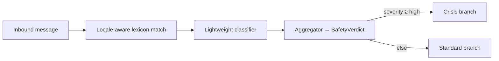

# 12 — Crisis protocol

This document specifies how Between Clouds detects and responds to
high-severity emotional or safety signals. It is the most ethically
sensitive subsystem and is treated as such operationally.

## 1. Scope

We detect and de-escalate signals related to:

- self-harm or suicidal ideation,
- harm to others or violence,
- acute psychosis-like ideation,
- severe acute crisis (panic at clinically relevant intensity).

We do **not** diagnose. We do **not** simulate clinicians. We **do**
de-escalate calmly and surface local human resources.

## 2. Detection pipeline



Layers:

1. **Lexicon** — locale-specific term lists, regularly reviewed by
   subject-matter experts. Used as a recall-favoring first pass.
2. **Classifier** — a calibrated model emitting `{ severity, category,
   confidence }`. Fail-closed: classifier unavailable → conservative
   crisis route.
3. **Aggregator** — combines lexicon + classifier + light context (recent
   turns, but only as features, not as logged content).

Output: `SafetyVerdict { severity: 'none'|'low'|'medium'|'high'|'critical',
category, confidence, locale, action }`.

## 3. Response strategy

### 3.1 Tone (binding)

- Calm. Slow. Grounding.
- Short sentences. No exclamation points.
- No dramatization. No "I'm so worried about you." No "please don't do this."

### 3.2 Content

For severity `high` / `critical`:

1. Acknowledge what was shared, briefly, without restating graphic details.
2. Offer one grounding micro-step (breath, contact with the body, naming
   surroundings).
3. Surface **local** resources for the user's locale/region.
4. Encourage human contact — a person they trust, or a hotline.
5. Do not promise to be there. Do not promise memory. Do not promise
   ongoing companionship.

For severity `medium`:

- Stay in standard branch but reduce pace and complexity. Hold one thread.
- Offer the resource list as a soft mention, not a redirection.

### 3.3 Resources

Maintained per region, version-controlled, reviewed quarterly. Stored at:

```
shared/prompts/resources/{region-locale}.json
```

Each entry:

```json
{
  "label": "Samaritans (UK)",
  "phone": "116 123",
  "url": "https://www.samaritans.org/",
  "available": "24/7",
  "notes": "Free, confidential."
}
```

Mandatory regions for v1: UK, BR, US, EU (general).

## 4. Operational treatment

- The Safety classifier is **fail-closed**: if it cannot return a verdict,
  the orchestrator routes conservatively to the crisis branch with a
  reduced-scope response and resource surfacing. Better a slightly more
  cautious response than a missed signal.
- Crisis events emit a minimal audit record: `{ user_id_hmac, severity,
  category, locale, timestamp }`. **No content.** This is for ops
  awareness and capacity planning, not analysis.
- An on-call engineer is paged on classifier outages.

## 5. Operator boundaries

- Operators have no path to read user content.
- Operators may see **counts and severities** of crisis events for
  capacity planning.
- Operators may **never** intervene live in a user conversation. There is
  no human-in-the-loop "co-pilot" surface to a live session.
- If law enforcement or regulators compel data, the response is governed
  by `09-security-and-compliance.md` and the absence of content storage.

## 6. Evaluation

- A regression suite of synthetic crisis prompts in each supported locale,
  run on every change to the safety code, lexicons, or prompts.
- A quarterly review by SMEs (clinical, suicidology specialists) of the
  crisis copy, the resource list, and the classifier's failure modes.
- Bias audit per locale — recall must not collapse for non-English locales.

## 7. What this protocol cannot do

- It cannot prevent all crises. We are explicit with users that we are
  not emergency support.
- It cannot replace human contact. The protocol's success is measured by
  whether users are gently and effectively pointed toward people, not by
  whether they continued the conversation.

## 8. Copy examples (illustrative, non-binding)

EN, severity high:

> What you're carrying sounds heavy. You don't have to hold it alone right
> now. If you can, take one slow breath with me, then reach out to
> [local hotline]. I'll stay calm here while you do.

PT-BR, severity high:

> O que você está carregando parece pesado. Você não precisa segurar isso
> sozinho agora. Se puder, respire devagar uma vez comigo, e em seguida
> entre em contato com [linha local]. Vou ficar aqui em silêncio enquanto
> você faz isso.

These are starting points. Final wording is reviewed with SMEs and lives
in the locale catalog.
